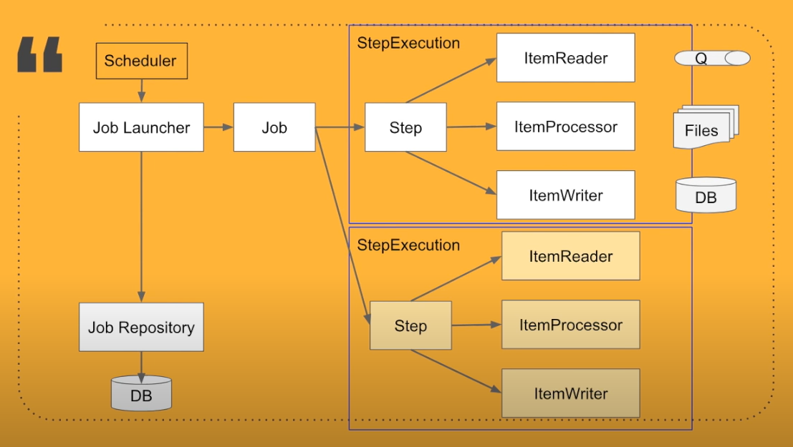

# Spring Boot with Spring Batch Example

## Spring Batch Architecture

## Load CSV file to h2 db

* Csv file

| Id | Name | Dept | Salary |
|:---:| :---:|:---:|:---:|
| 1  | Peter  | 001 | 12000 |
| 2  | Mike  | 002 | 13000 |
| 3 | Ryan | 003 | 10000 |

* http://localhost:8081/load - Trigger point for Spring Batch
* http://localhost:8081/h2-console - H2 Console for querying the in-memory tables.

## Query to monitor Job Batch Execution

* SELECT * FROM USER;

### Job Execution
* SELECT * FROM BATCH_JOB_EXECUTION;
* SELECT * FROM BATCH_JOB_EXECUTION_CONTEXT;

### Step Execution
* SELECT * FROM BATCH_STEP_EXECUTION;
* SELECT * FROM BATCH_STEP_EXECUTION_CONTEXT;